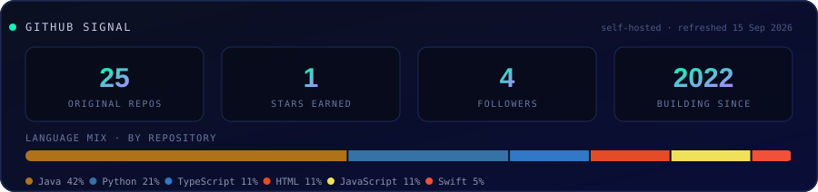

<!--
  Profile README — yogeshwankhede007
  Every image below is either (a) an SVG committed in this repository and referenced
  by relative path, or (b) a static badge from img.shields.io, which GitHub serves
  through its own Camo proxy. No trackers, no view counters, no dead-host redirects.
  See the "How this README is built" section at the bottom.
-->

<div align="center">
  
</div>

<div align="center">

[](https://www.linkedin.com/in/ywankhede/)
[](mailto:yogi.wankhede007@gmail.com)
[](https://github.com/yogeshwankhede007?tab=repositories)


</div>


## The Pivot

> ### **Most developers learn to test.**
> ### **I'm a tester who learned to build — and that order changes everything.**

I spent my career on the other side of the pull request: breaking mobile apps, stress-testing APIs until they buckled, and engineering the chaos that production would eventually deliver anyway. I know exactly where software fails, because finding that was my job.

**Now I'm building it.** I'm transitioning into a full-time developer role — **React on the frontend, Python on the backend** — and carrying every hard-won instinct with me. The null check I add without thinking. The race condition I can smell. The error state designed before the happy path. That's not a career change; that's a compounding advantage.

<table>
<tr>
<td width="50%" valign="top">

### 🧪 Where I Came From

- **Senior SDET** across mobile, web, API, performance and chaos engineering
- Architected automation frameworks in **Java, Python, TypeScript and Swift**
- Owned **CI/CD quality gates** that decided what shipped and what didn't
- Broke systems on purpose — with **ToxiProxy, k6, JMeter** and a lot of patience

</td>
<td width="50%" valign="top">

### 🚀 Where I'm Heading

- **Full-Stack Developer** — **React + TypeScript** front, **Python** back
- Shipping **features and products**, not just the suites that verify them
- Building **AI-native applications** where agents are part of the architecture
- Writing code that is **tested, observable and secure by default** — day one

</td>
</tr>
</table>


## About Me

```typescript
const yogesh: Engineer = {
  name:       "Yogesh Wankhede",
  location:   "Pune, India 🇮🇳",
  company:    "Syngenta Group",
  title:      "Senior Software Engineer",
  transition: "Senior SDET  ──▶  Full-Stack Developer",

  buildingWith: {
    frontend: ["React", "TypeScript", "JavaScript", "HTML5", "CSS3"],
    backend:  ["Python", "FastAPI", "Java", "REST", "GraphQL"],
    data:     ["PostgreSQL", "MongoDB", "Redis"],
    cloud:    ["Docker", "Kubernetes", "GitHub Actions", "AWS"],
  },

  unfairAdvantage: "I've watched software fail in every way it can. Now I build so it doesn't.",

  currentlyShipping: ["Mobix-AI", "kisan-mausam-alert", "WebSec-AI"],
  currentlyLearning: ["System Design", "React Performance", "Async Python at scale"],

  principles: ["Ship fast.", "Ship tested.", "Ship secure."],
};
```


## Tech Arsenal

<details open>
<summary><b>⚛️ &nbsp;Frontend — what the user actually touches</b></summary>
<br/>


</details>

<details open>
<summary><b>🐍 &nbsp;Backend — where the logic lives</b></summary>
<br/>


</details>

<details open>
<summary><b>🤖 &nbsp;AI-Native Development — agents as architecture, not autocomplete</b></summary>
<br/>


</details>

<details open>
<summary><b>☁️ &nbsp;DevOps & Cloud — from laptop to production</b></summary>
<br/>


</details>

<details open>
<summary><b>🧪 &nbsp;Quality Engineering — the advantage I'm not leaving behind</b></summary>
<br/>


</details>


## Featured Builds

<table>
<tr>
<td width="50%" valign="top">

### 🧠 [Mobix-AI](https://github.com/yogeshwankhede007/Mobix-AI)

Where AI meets the mobile app — **autonomous mobile testing at the speed of thought.** An MCP-powered agent that drives real devices instead of following hardcoded scripts.


</td>
<td width="50%" valign="top">

### 🌾 [kisan-mausam-alert](https://github.com/yogeshwankhede007/kisan-mausam-alert)

AI-powered weather alerts for Indian farmers. Monitors **IMD forecasts** and pushes crop-specific advisories in the farmer's own language. Python backend with real-world impact.


</td>
</tr>
<tr>
<td width="50%" valign="top">

### 🔐 [WebSec-AI](https://github.com/yogeshwankhede007/WebSec-AI)

A toolkit that fuses **AI with offensive security technique** to detect and prevent web application vulnerabilities — OWASP coverage with prompt-engineered analysis.


</td>
<td width="50%" valign="top">

### ⚙️ [python-pro-with-cicd](https://github.com/yogeshwankhede007/python-pro-with-cicd)

Production-grade Python CI/CD template: automated **quality gates, security scanning, multi-stage deployments** and GitOps practice, wired end to end with GitHub Actions.


</td>
</tr>
<tr>
<td width="50%" valign="top">

### 🌪️ [chaos-test-framework](https://github.com/yogeshwankhede007/chaos-test-framework)

Simulate, disrupt, fortify. A **BDD-driven Java framework using ToxiProxy** to prove system resilience under real-world network chaos — latency, jitter, partitions and worse.


</td>
<td width="50%" valign="top">

### 📈 [PerformanceTestWithK6](https://github.com/yogeshwankhede007/PerformanceTestWithK6)

Modern load testing done right — **k6 + InfluxDB + Grafana**, wired into CI so performance regressions get caught by a pipeline instead of a customer.


</td>
</tr>
</table>

<details>
<summary><b>📦 &nbsp;More from the workshop</b></summary>
<br/>

| Project | What it does | Stack |
|:--|:--|:--|
| [letcode-web-automation](https://github.com/yogeshwankhede007/letcode-web-automation) | Playwright web automation playground — modern locators, fixtures, parallel runs | `TypeScript` `Playwright` |
| [mobile-automation-framework-cursor-ai](https://github.com/yogeshwankhede007/mobile-automation-framework-cursor-ai) | Appium + TestNG + Maven framework built with AI-assisted code generation | `Java` `Appium` `Cursor AI` |
| [windsurf-mobile-automation](https://github.com/yogeshwankhede007/windsurf-mobile-automation) | React Native UI testing across Android & iOS on Appium 2.x | `Python` `Appium 2.x` |
| [eReservations](https://github.com/yogeshwankhede007/eReservations) | REST API testing framework — booking flows, auth and CRUD across environments | `Java` `REST Assured` `Gatling` |
| [Calculator-UI-Testing-Framework](https://github.com/yogeshwankhede007/Calculator-UI-Testing-Framework) | Extensible iOS UI automation on XCTest with modular page objects | `Swift` `XCTest` |
| [dsa-dp-practice-java](https://github.com/yogeshwankhede007/dsa-dp-practice-java) | Curated data structures, algorithms and DP solutions, written for clarity | `Java` |

</details>


## Experience

<table>
<tr>
<td valign="top" width="30%">

**Syngenta Group**
`Present`


Pune, India

</td>
<td valign="top" width="70%">

- Moving from **quality engineering into full-stack product development** — React interfaces and Python services
- Built and owned automation across **mobile, web, API and performance**, feeding CI/CD quality gates
- Introduced **AI-assisted engineering practices** into day-to-day delivery workflows
- Mentor to engineers learning automation, clean code and the habit of testing early

</td>
</tr>
</table>

<!--
  Add earlier roles here using the same two-column block:

  <tr>
  <td valign="top" width="30%">
  **Company Name**
  `2019 — 2022`
  ...
  </td>
  <td valign="top" width="70%">
  - Achievement one
  </td>
  </tr>
-->


## GitHub Signal

<div align="center">
  
</div>

<div align="center">
  <picture>
    <source media="(prefers-color-scheme: dark)" srcset="assets/generated/snake-dark.svg">
    <source media="(prefers-color-scheme: light)" srcset="assets/generated/snake-light.svg">
    
  </picture>
</div>

<div align="center">
  <sub>📡 Both images are generated inside this repository by a scheduled, SHA-pinned GitHub Action — not fetched from a third-party image service.</sub>
</div>


## How I Build

<table>
<tr>
<td align="center" width="25%">

### 🧬
**Tests aren't a phase**

They're a design constraint. Code that's hard to test is telling you something.

</td>
<td align="center" width="25%">

### 🔭
**If it isn't observable**

it isn't done. Logs, metrics and traces ship with the feature, not after it.

</td>
<td align="center" width="25%">

### 🛡️
**Secure by default**

beats secure by review. The safe path should also be the easy one.

</td>
<td align="center" width="25%">

### ⚡
**Automate the boring**

Obsess over the edge. The interesting bugs live where nobody looks.

</td>
</tr>
</table>

<div align="center">

> *"Quality is not an act, it is a habit."* — **Aristotle**
>
> *"…and habits are what I'm compiling into production code."* — **me**

</div>


## How This README Is Built

I test software for a living, so the page introducing me gets the same scrutiny. Profile READMEs are quietly one of the most third-party-dependent pages on GitHub — this one isn't.

| Decision | Why |
|:--|:--|
| 🎨 **All artwork is SVG committed in this repo** | Referenced by relative path. No external host can change what this page shows. |
| 🚫 **No view counters or tracking pixels** | Counter services log every visitor to your profile. Removed. |
| ⚰️ **No `*.herokuapp.com` or personal-app image endpoints** | Retired free-tier hosts can be re-registered by anyone, and then they choose the image. |
| 🏷️ **Badges come only from `img.shields.io`** | Static, no PII, and GitHub's Camo proxy means visitor IPs never reach it. |
| 📌 **Every GitHub Action pinned to a full commit SHA** | Tags are mutable; SHAs are not. Supply-chain basics. |
| 🔑 **Least-privilege workflow token** | `permissions: contents: write`, the automatic `GITHUB_TOKEN`, and no PAT. |
| 🧾 **Stats generated from `api.github.com` only** | [`build_stats_svg.py`](.github/scripts/build_stats_svg.py) is ~200 lines you can read in full. |

<sub>Read the workflow: [`.github/workflows/profile-assets.yml`](.github/workflows/profile-assets.yml)</sub>


## Let's Build Something

<div align="center">

**I'm looking for full-stack roles where a developer's craft and a tester's paranoia are both assets.**

If you're building something that has to work — not just demo well — let's talk.

<br/>

[](https://www.linkedin.com/in/ywankhede/)
[](mailto:yogi.wankhede007@gmail.com)
[](https://github.com/yogeshwankhede007)

<br/>

<sub>Built with relative paths, pinned SHAs and zero trackers. ⚡</sub>

</div>
