<!--
  Profile README — yogeshwankhede007
  Every image below is either (a) an SVG committed in this repository and referenced
  by relative path, or (b) a static badge from img.shields.io, which GitHub serves
  through its own Camo proxy. No trackers, no view counters, no dead-host redirects.

  Cards are generated, never hand-edited:
    python .github/scripts/build_cards.py                      -> assets/cards/*
    python .github/scripts/build_stats_svg.py <user> <out.svg> -> assets/generated/*
-->

<div align="center">
  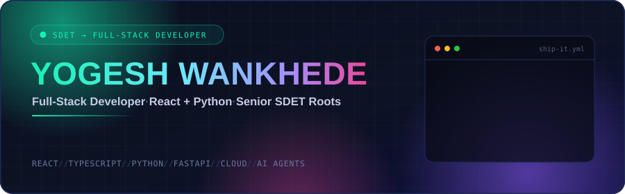
</div>

<div align="center">

[](https://www.linkedin.com/in/ywankhede/)
[](mailto:yogi.wankhede007@gmail.com)
[](https://github.com/yogeshwankhede007?tab=repositories)


</div>


## The Pivot

> ### **Most developers learn to test.**
> ### **I'm a tester who learned to build — and that order changes everything.**

I spent my career on the other side of the pull request: breaking mobile apps, stress-testing APIs until they buckled, and engineering the chaos that production would eventually deliver anyway. I know exactly where software fails, because finding that was my job.

**Now I'm building it.** I'm transitioning into a full-time developer role — **React on the frontend, Python on the backend** — and carrying every hard-won instinct with me. The null check I add without thinking. The race condition I can smell. The error state designed before the happy path. That's not a career change; that's a compounding advantage.

<table>
<tr>
<td width="50%" valign="top">

### 🧪 Where I Came From

- **Senior SDET** across mobile, web, API, performance and chaos engineering
- Architected automation frameworks in **Java, Python, TypeScript and Swift**
- Owned **CI/CD quality gates** that decided what shipped and what didn't
- Broke systems on purpose — with **ToxiProxy, k6, JMeter** and a lot of patience

</td>
<td width="50%" valign="top">

### 🚀 Where I'm Heading

- **Full-Stack Developer** — **React + TypeScript** front, **Python** back
- Shipping **features and products**, not just the suites that verify them
- Building **AI-native applications** where agents are part of the architecture
- Writing code that is **tested, observable and secure by default** — day one

</td>
</tr>
</table>


## About Me

```typescript
const yogesh: Engineer = {
  name:       "Yogesh Wankhede",
  location:   "Pune, India 🇮🇳",
  company:    "Syngenta Group",
  title:      "Senior Software Engineer",
  transition: "Senior SDET  ──▶  Full-Stack Developer",

  buildingWith: {
    frontend: ["React", "TypeScript", "JavaScript", "HTML5", "CSS3"],
    backend:  ["Python", "FastAPI", "Java", "REST", "GraphQL"],
    data:     ["PostgreSQL", "MongoDB", "Redis"],
    cloud:    ["Docker", "Kubernetes", "GitHub Actions", "AWS"],
  },

  unfairAdvantage: "I've watched software fail in every way it can. Now I build so it doesn't.",

  currentlyShipping: ["Mobix-AI", "kisan-mausam-alert", "WebSec-AI"],
  currentlyLearning: ["System Design", "React Performance", "Async Python at scale"],

  strengths: [
    "Critical Thinking", "Logical Mindset", "Communication", "Leadership",
    "Presentation", "Problem Solving", "Collaboration", "Adaptability",
  ],

  principles: ["Ship fast.", "Ship tested.", "Ship secure."],
};
```


## Tech Arsenal

<details open>
<summary><b>⚛️ &nbsp;Frontend — what the user actually touches</b></summary>
<br/>

<div align="center">


</div>

</details>

<details open>
<summary><b>🐍 &nbsp;Backend — where the logic lives</b></summary>
<br/>

<div align="center">


</div>

</details>

<details open>
<summary><b>🤖 &nbsp;AI-Native Development — agents as architecture, not autocomplete</b></summary>
<br/>

<div align="center">


</div>

</details>

<details open>
<summary><b>☁️ &nbsp;DevOps & Cloud — from laptop to production</b></summary>
<br/>

<div align="center">


</div>

</details>

<details open>
<summary><b>🧪 &nbsp;Quality Engineering — the advantage I'm not leaving behind</b></summary>
<br/>

<div align="center">


</div>

</details>


## Beyond the Code

<div align="center">
  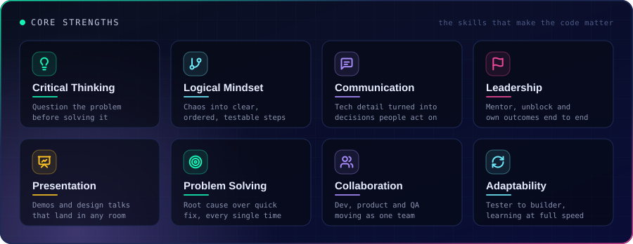
</div>

<div align="center">


</div>


## Featured Builds

<p align="center">
  <a href="https://github.com/yogeshwankhede007/Mobix-AI">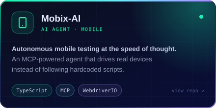</a>
  <a href="https://github.com/yogeshwankhede007/kisan-mausam-alert">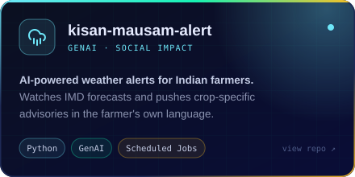</a>
</p>

<p align="center">
  <a href="https://github.com/yogeshwankhede007/WebSec-AI">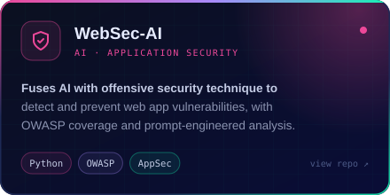</a>
  <a href="https://github.com/yogeshwankhede007/python-pro-with-cicd">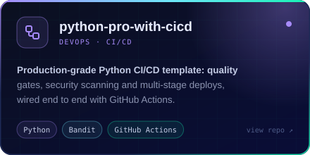</a>
</p>

<p align="center">
  <a href="https://github.com/yogeshwankhede007/chaos-test-framework">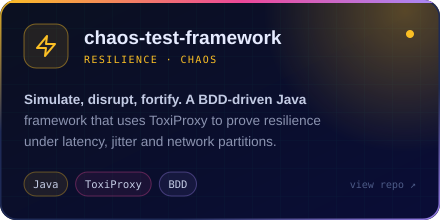</a>
  <a href="https://github.com/yogeshwankhede007/PerformanceTestWithK6">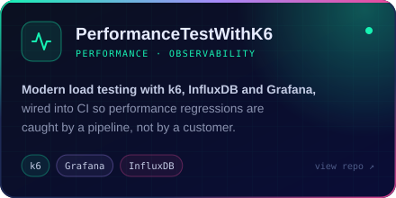</a>
</p>

<details>
<summary><b>📦 &nbsp;More from the workshop</b></summary>
<br/>

| Project | What it does | Stack |
|:--|:--|:--|
| [letcode-web-automation](https://github.com/yogeshwankhede007/letcode-web-automation) | Playwright web automation playground — modern locators, fixtures, parallel runs | `TypeScript` `Playwright` |
| [mobile-automation-framework-cursor-ai](https://github.com/yogeshwankhede007/mobile-automation-framework-cursor-ai) | Appium + TestNG + Maven framework built with AI-assisted code generation | `Java` `Appium` `Cursor AI` |
| [windsurf-mobile-automation](https://github.com/yogeshwankhede007/windsurf-mobile-automation) | React Native UI testing across Android & iOS on Appium 2.x | `Python` `Appium 2.x` |
| [eReservations](https://github.com/yogeshwankhede007/eReservations) | REST API testing framework — booking flows, auth and CRUD across environments | `Java` `REST Assured` `Gatling` |
| [Calculator-UI-Testing-Framework](https://github.com/yogeshwankhede007/Calculator-UI-Testing-Framework) | Extensible iOS UI automation on XCTest with modular page objects | `Swift` `XCTest` |
| [dsa-dp-practice-java](https://github.com/yogeshwankhede007/dsa-dp-practice-java) | Curated data structures, algorithms and DP solutions, written for clarity | `Java` |

</details>


## Experience

<div align="center">
  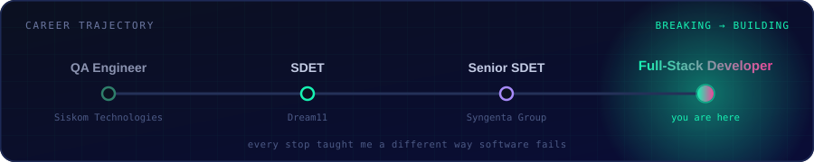
</div>

<table>
<tr>
<td valign="top" width="30%">

### 🌱 Syngenta Group


`Pune, India` &nbsp;·&nbsp; `Current`


</td>
<td valign="top" width="70%">

- Moving from **quality engineering into full-stack product development** — React interfaces on the front, Python services behind them
- Built and owned automation across **mobile, web, API and performance**, wired directly into CI/CD quality gates
- Introduced **AI-assisted engineering practices** into day-to-day delivery workflows
- Mentor engineers on automation, clean code and the habit of testing early

</td>
</tr>
<tr>
<td valign="top" width="30%">

### 🏏 Dream11


`Mumbai, India` &nbsp;·&nbsp; `On-site`


</td>
<td valign="top" width="70%">

- Operated inside a high-velocity **continuous integration environment spanning Android and iOS** — fantasy sports at national scale, where a bad release is visible to millions
- Worked shoulder to shoulder with developers, product owners, managers and directors, applying **shift-left strategy** to understand the product domain before a line of test code existed
- Built **automated functional integration and end-to-end suites** on internal test frameworks
- Covered **UI and API automation, Google Analytics validation** and intelligent client-handling cloud within an Agile delivery model

</td>
</tr>
<tr>
<td valign="top" width="30%">

### 🛰️ Siskom Technologies


`Pune, India` &nbsp;·&nbsp; `On-site`


</td>
<td valign="top" width="70%">

- Managed, configured and maintained **enterprise-grade network hardware, servers and software systems**, holding **99.9% uptime** for mission-critical client operations
- Monitored and optimised system performance, applying **proactive maintenance to prevent outages** before they reached the customer
- Where the instinct started: watching real systems fail in production taught me what test cases never could

</td>
</tr>
</table>


## GitHub Signal

<div align="center">
  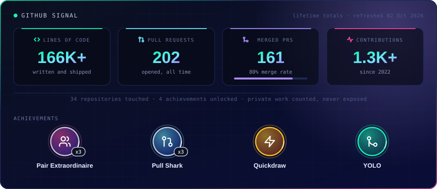
</div>

<div align="center">
  <picture>
    <source media="(prefers-color-scheme: dark)" srcset="assets/generated/snake-dark.svg">
    <source media="(prefers-color-scheme: light)" srcset="assets/generated/snake-light.svg">
    
  </picture>
</div>

<sub>Lifetime totals, refreshed daily by a pinned GitHub Action. Private and organisation work is summed into the totals; no repository, organisation or project detail is ever published.</sub>


## How I Build

<div align="center">
  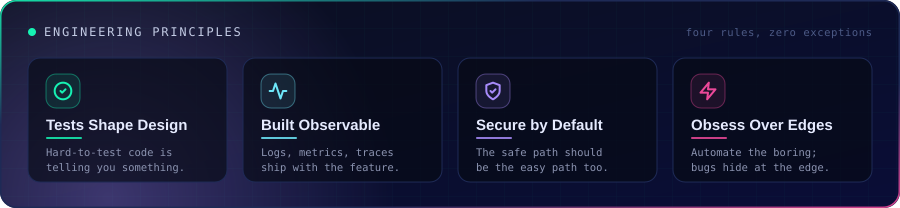
</div>

<div align="center">
  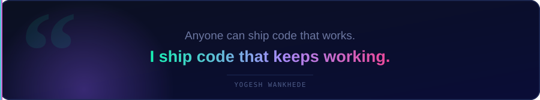
</div>


## Let's Build Something

<div align="center">

**I'm looking for full-stack roles where a developer's craft and a tester's paranoia are both assets.**

If you're building something that has to work — not just demo well — let's talk.

<br/>

[](https://www.linkedin.com/in/ywankhede/)
[](mailto:yogi.wankhede007@gmail.com)
[](https://github.com/yogeshwankhede007)

</div>
